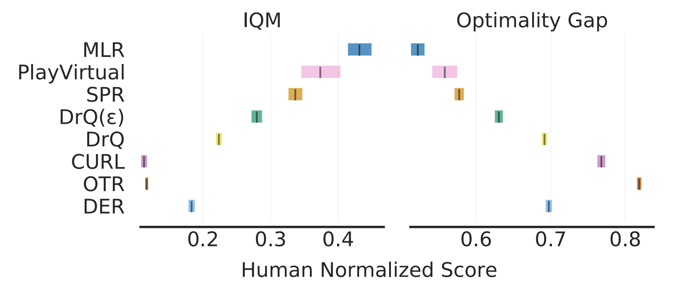
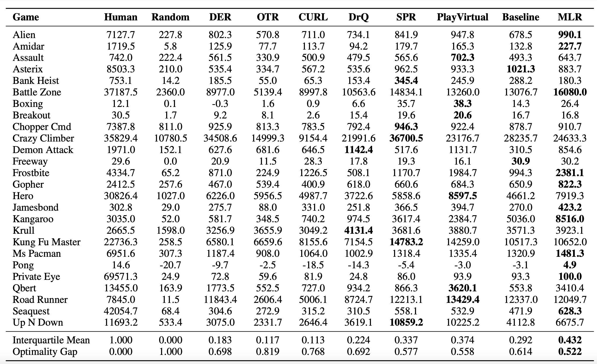
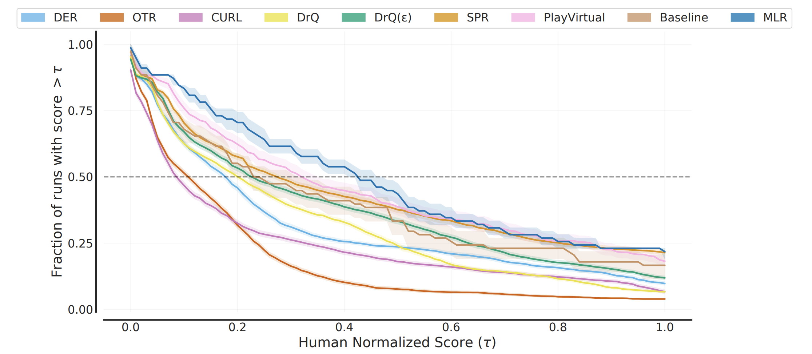

# MLR for Atari
## Installation
Install the requirements:
~~~
pip install -r requirements.txt
~~~

## Usage
Train MLR:
~~~
python -m scripts.run --public --mlr-weight 1 --jumps 15 --game alien --seed 1 --final-eval-only 1
~~~

Some important options:
* `jumps`: sequence length (For example, jumps=15 means we sample a trajectory from t=0:15, which will include 16 consecutive observations);
* `mlr-weight`: MLR loss weight;
* `game`: to specify the game;
* `seed`: to specify the seed;
* `final-eval-only`: evaluating agent at the end step ("1") or every 10k steps ("0");
* Other hyperparameters (input image size, mask ratio, block size & patch size): simply modify Line 368-371 in ./src/models.py.

## Result
### IQM and OG
Comparison results on Atari-100k. Aggregate metrics (IQM and optimality gap (OG)) with 95\% confidence intervals (CIs) are used for the evaluation. Higher IQM and lower OG are better.

### Full Scores
Comparison on the Atari-100k benchmark. Our method reaches the highest scores on 11 out of 26 games and the best performance concerning the aggregate metrics, i.e., IQM and OG with 95\% confidence intervals. Our method augments Baseline with the MLR objective and achieves a 47.9\% relative improvement on IQM.

### Performance Profiles

Performance profiles on the Atari-100k benchmark based on human-normalized score distributions. Shaded regions indicates 95\% confidence bands. The score distribution of MLR is clearly superior to previous methods and Baseline.

## Acknowledgement
The implementation on Atari is partially based on [SPR](https://github.com/mila-iqia/spr) by Max Schwarzer & Ankesh Anand. We sincerely thank the authors.