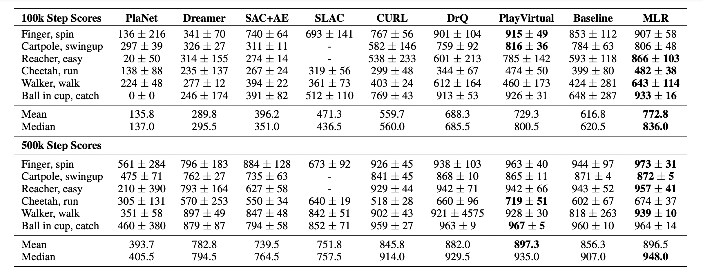

# MLR for DMControl
## Installation
Install the requirements:
~~~
pip install -r requirements.txt
~~~

Uninstall glfw if your machine is core dumped:
~~~
pip uninstall glfw -y
~~~
Or simply add this line to `train.py` if your machine meets glfw errors:
~~~
os.environ['MUJOCO_GL'] = 'egl'
~~~

## Usage
Here we give the configuration files in the `./configs` folder for the six environments mentioned in the paper. 

```
cd ./src
python train.py --config-path ./configs --config-name cartpole_swingup jumps=15 \
    seed=1 agent=mtm_sac num_env_steps=100000 work_dir=output wandb=false
```

Some important options in configuration files:
* `agent`: mtm_sac is our MLR agent;
* `jumps`: sequence length (For example, jumps=15 means we sample a trajectory from t=0:15, which will include 16 consecutive observations);
* `num_env_step`: total environment steps. Note that environment steps = interaction steps * action repeat;
* `mask_ratio`: mask ratio;
* `patch_size`: spatial patch size;
* `block_size`: temporal block size;
* `work_dir`: output directory;
* `wandb`: if True, then wandb visualization is turned on.


## Result
We achieve the best result on both DMControl-100k and DMControl-500k benchmarks. Our result is averaged over 10 random seeds.



## Acknowledgement
Our implementation on DMControl is partially based on [CURL](https://github.com/MishaLaskin/curl) by Michael Laskin & Aravind Srinivas. We sincerely thank the authors.