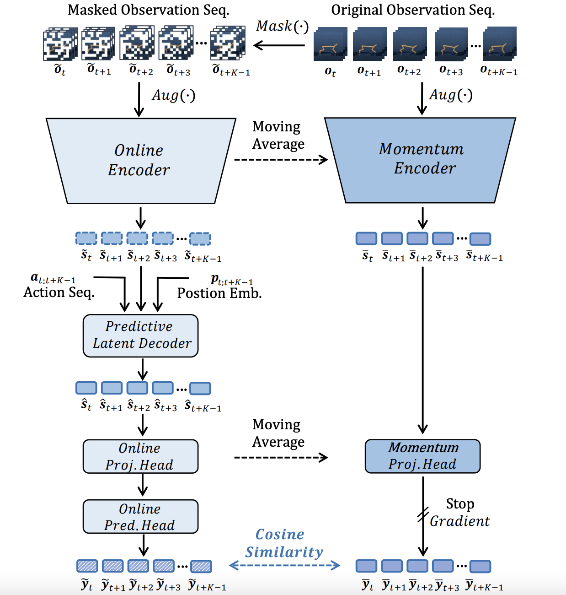

# Mask-based Latent Reconstruction for Reinforcement Learning

This is the official implementation of *[Masked-based Latent Reconstruction for Reinforcement Learning](https://arxiv.org/abs/2201.12096)* (accepted by NeurIPS 2022), which outperforms the state-of-the-art sample-efficient reinforcement learning methods such as [CURL](https://arxiv.org/abs/2004.04136), [DrQ](https://arxiv.org/abs/2004.13649), [SPR](https://openreview.net/forum?id=uCQfPZwRaUu), [PlayVirtual](https://arxiv.org/abs/2106.04152), etc.

- [arXiv](https://openreview.net/forum?id=GSHFVNejxs7&referrer=%5BAuthor%20Console%5D(%2Fgroup%3Fid%3DNeurIPS.cc%2F2021%2FConference%2FAuthors%23your-submissions))
- [OpenReview](https://openreview.net/forum?id=-zlJOVc580)
- [SlidesLive](https://recorder-v3.slideslive.com/#/share?share=74702&s=2295c61d-8048-439f-a718-54adb5b8b629)

## Abstract
For deep reinforcement learning (RL) from pixels, learning effective state representations is crucial for achieving high performance. However, in practice, limited experience and high-dimensional inputs prevent effective representation learning. To address this, motivated by the success of mask-based modeling in other research fields, we introduce mask-based reconstruction to promote state representation learning in RL. Specifically, we propose a simple yet effective self-supervised method, Mask-based Latent Reconstruction (MLR), to predict complete state representations in the latent space from the observations with spatially and temporally masked pixels. MLR enables better use of context information when learning state representations to make them more informative, which facilitates the training of RL agents. Extensive experiments show that our MLR significantly improves the sample efficiency in RL and outperforms the state-of-the-art sample-efficient RL methods on multiple continuous and discrete control benchmarks. 

## Framework



Figure 1. The framework of the proposed MLR. We perform a random spatial-temporal masking (i.e., *cube* masking) on the sequence of consecutive observations in the pixel space. The masked observations are encoded to be the latent states through an online encoder. We further introduce a predictive latent decoder to decode/predict the latent states conditioned on the corresponding action sequence and temporal positional embeddings. Our method trains the networks to reconstruct the information available in the missing contents in an appropriate *latent* space using a cosine similarity based distance metric applied between the predicted features of the reconstructed states and the target features inferred from original observations by momentum networks.

  
## Run MLR
We provide codes for two benchmarks: Atari and DMControl.
~~~
.
├── Atari
|   ├── README.md
|   └── ...
|── DMControl
|   ├── README.md
|   └── ...
├── CODE_OF_CONDUCT.md
├── LICENSE
├── README.md
├── SUPPORT.md
└── SECURITY.md
~~~

Run Atari code: enter ./Atari for more information.
~~~
cd ./Atari
~~~
Run DMControl code: enter ./DMControl for more information.
~~~
cd ./DMControl
~~~

## Citation
Please use the following BibTeX to cite our work.  
```
@article{yu2022mask,
  title={Mask-based latent reconstruction for reinforcement learning},
  author={Yu, Tao and Zhang, Zhizheng and Lan, Cuiling and Lu, Yan and Chen, Zhibo},
  journal={Advances in Neural Information Processing Systems},
  volume={35},
  pages={25117--25131},
  year={2022}
}
```

## Contributing

This project welcomes contributions and suggestions.  Most contributions require you to agree to a
Contributor License Agreement (CLA) declaring that you have the right to, and actually do, grant us
the rights to use your contribution. For details, visit https://cla.opensource.microsoft.com.

When you submit a pull request, a CLA bot will automatically determine whether you need to provide
a CLA and decorate the PR appropriately (e.g., status check, comment). Simply follow the instructions
provided by the bot. You will only need to do this once across all repos using our CLA.

This project has adopted the [Microsoft Open Source Code of Conduct](https://opensource.microsoft.com/codeofconduct/).
For more information see the [Code of Conduct FAQ](https://opensource.microsoft.com/codeofconduct/faq/) or
contact [opencode@microsoft.com](mailto:opencode@microsoft.com) with any additional questions or comments.

## Trademarks

This project may contain trademarks or logos for projects, products, or services. Authorized use of Microsoft 
trademarks or logos is subject to and must follow 
[Microsoft's Trademark & Brand Guidelines](https://www.microsoft.com/en-us/legal/intellectualproperty/trademarks/usage/general).
Use of Microsoft trademarks or logos in modified versions of this project must not cause confusion or imply Microsoft sponsorship.
Any use of third-party trademarks or logos are subject to those third-party's policies.
